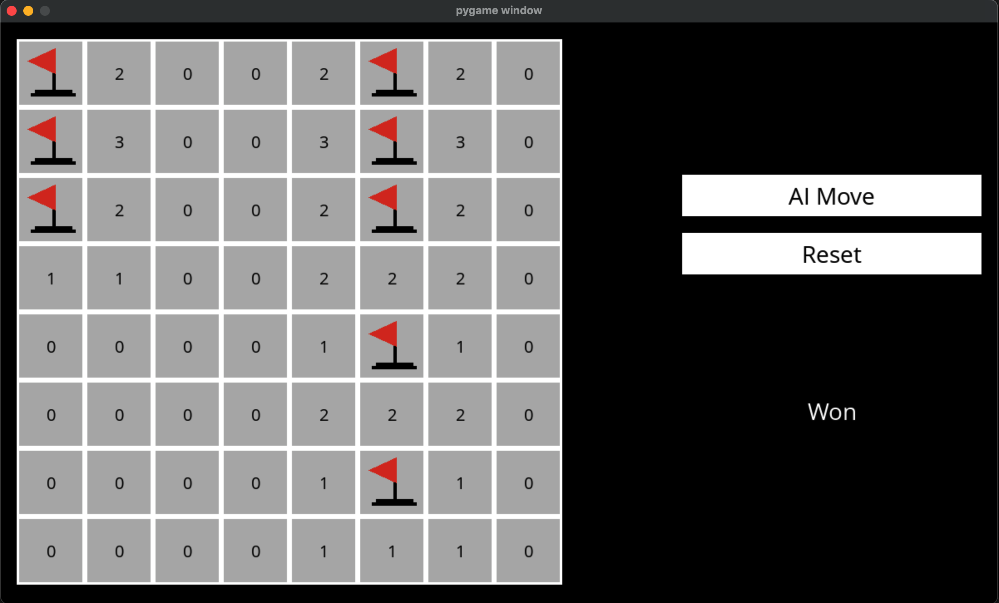

# 🎮 Minesweeper AI



This project focuses on building an **AI agent** that plays Minesweeper using **propositional logic** and **inference-based reasoning** to uncover safe cells and locate hidden mines.

---

## 📚 Table of Contents

- [🧠 Project Overview](#-project-overview)
- [🧠 How the AI Agent Works](#-how-the-ai-agent-works)
- [✨ Reasoning Architecture](#-reasoning-architecture)
- [🛠️ Features](#-features)
- [🧪 AI Concepts Applied](#-ai-concepts-applied)
- [📁 Project Structure](#-project-structure)
- [🚀 Getting Started](#-getting-started)

---

## 🧠 Project Overview

This project brings logic-based AI to the classic game of **Minesweeper**. Unlike random guessing, the AI:

> 🧠 **Builds a knowledge base of logical sentences**  
> 🎯 **Infers safe moves and mines based on logical deductions**  
> 💥 **Can play autonomously — and win without cheating**

This is an ideal playground for exploring how AI can reason under uncertainty, with real-world parallels in:

- Robot navigation through dangerous terrain  
- Safety-critical systems (like airbag deployment or failover detection)  
- Rule-based decision-making in uncertain environments

---

## 🧠 How the AI Agent Works

The AI maintains a **knowledge base** composed of **sentences** like:

> "These 3 unknown cells contain exactly 1 mine"

It updates its knowledge after every move by:

1. Marking the selected cell as safe
2. Gathering neighbors and constructing a logical sentence
3. Making new inferences about other cells
4. Propagating new knowledge recursively

This leads to a continuously improving understanding of the board — all **without peeking** at hidden information.

---

### ✨ Reasoning Architecture

Internally, the AI agent uses:

- A `Sentence` class to represent constraints like `{(1, 2), (2, 2)} = 1`
- A knowledge base (`self.knowledge`) that accumulates logic rules
- Inference mechanisms to deduce **new rules from existing ones**
- AI methods like `mark_mine`, `mark_safe`, and `add_knowledge`
- Recursive inference cycles that propagate new conclusions

> 🧠 This is logic-based AI — no randomness unless absolutely necessary.

---

## 🛠️ Features

- ✅ AI reasoning engine using propositional logic  
- ✅ Dynamically infers safe moves and mines  
- ✅ Interactive gameplay via Pygame UI  
- ✅ Clean modular design separating logic from UI  
- ✅ No guessing unless logically forced

---

## 🧪 AI Concepts Applied

| Concept                    | Description                                                  |
|----------------------------|--------------------------------------------------------------|
| **Propositional Logic**    | Represents knowledge using logical sentences                 |
| **Inference Rules**        | Deduce new knowledge from existing constraints               |
| **Constraint Satisfaction**| Treats the game as a set of solvable logical constraints     |
| **Recursive Deduction**    | Infers knowledge through subset and equality relationships   |
| **Knowledge Representation**| Stores rules and facts the AI uses to reason logically     |

---

## 📁 Project Structure

| File              | Description                                    |
|-------------------|------------------------------------------------|
| `minesweeper.py`  | Core logic for game and AI reasoning           |
| `runner.py`       | Pygame-based UI for human/AI interaction       |
| `assets/`         | UI fonts and images (flag, mine)               |
| `requirements.txt`| Project dependencies (`pygame`)                |

---

## 🚀 Getting Started

Set up the project on your machine and start playing against the AI:

### 1. Clone the Repository

```bash
git clone https://github.com/RichardPinheiro/minesweeper-AI.git
cd minesweeper-AI
```

### 2. Create a Virtual Environment (Recommended)

```bash
python3 -m venv .venv
```

### 3. Activate the Virtual Environment

```bash
source .venv/bin/activate
```
On Windows, use:
```bash
.venv\Scripts\activate
```

### 4. Install Dependencies

```bash
pip install -r requirements.txt
```

### 5. Run the Game

```bash
python3 runner.py
```